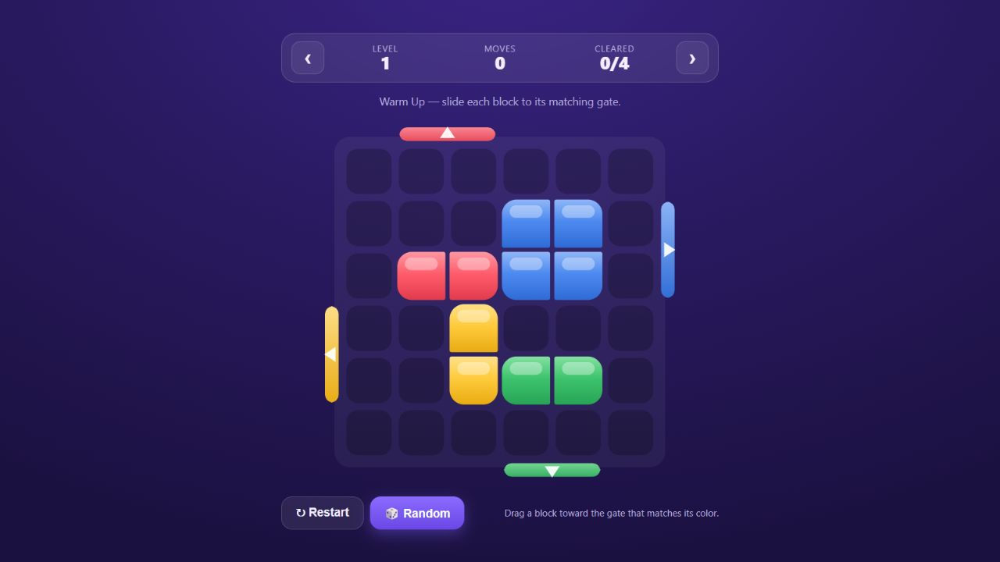
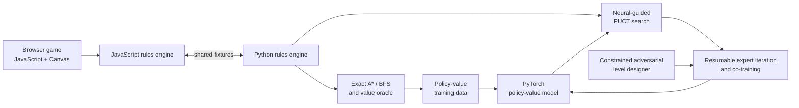

# Block Out Sort

**A slide-to-clear puzzle game with procedurally generated, provably solvable levels and a neural-guided search solver.**

[**Play the browser demo →**](https://dominikdjajadi.github.io/block-out-sort/) · [](https://github.com/DominikDjajadi/block-out-sort/actions/workflows/ci.yml)



Drag each colored block horizontally or vertically and push it through the matching gate. The browser game has no runtime dependencies; behind it is a Python research stack for exact solving, policy-value learning, bounded PUCT search, adversarial level generation, and reproducible co-training experiments.

> **Status:** The browser game is playable. The solver and training pipeline are active research, and mobile packaging is planned after the model is ready.

## Why this project is interesting

- **One ruleset, two implementations.** JavaScript powers the playable game while a matching Python environment supports search and training. Shared conformance fixtures keep them behaviorally aligned.
- **Solvability by construction.** The generator builds levels in reverse from valid exits, retaining a witness that every accepted puzzle can be solved.
- **Exact and learned search.** A*/BFS provide reference solutions and labels; a PyTorch policy-value model guides bounded PUCT search.
- **Research-grade evaluation.** Training runs are resumable and evaluated with frozen pools, candidate-blind confirmation, paired tests, per-budget regression guards, and explicit checkpoint ancestry.
- **An independently confirmed improvement.** The current research incumbent improved the preregistered weighted solve rate from `0.6104` to `0.6260` on 500 fresh levels, with a positive paired-bootstrap lower bound and no tested-budget regression.

[Read the research result](docs/research-results.md) · [See the architecture](docs/architecture.md) · [Review the encoding contract](docs/neural_encoding.md)

## Play locally

No build step is required:

```bash
python -m http.server 8000
```

Then open <http://localhost:8000>. You can also open `index.html` directly in a modern browser.

### Controls

- Drag a block up, down, left, or right.
- A block clears when it crosses a matching gate.
- Clear every block to finish the level.
- Frozen blocks, locked gates, and locked regions introduce delayed interactions on later levels.

## Architecture



The important boundary is the rules engine: search, generation, labels, training, and evaluation all operate on the same game semantics. See [docs/architecture.md](docs/architecture.md) for the full data and evaluation flow.

## Python setup

Python 3.10 or newer is required.

```bash
cd python
python -m venv .venv

# Windows
.venv\Scripts\activate

# macOS / Linux
source .venv/bin/activate

python -m pip install --upgrade pip
python -m pip install -e ".[dev]"
pytest -q
```

Run the cross-language conformance suite from the repository root:

```bash
node tools/run_conformance.js
```

Solve a bundled level exactly:

```bash
cd python
python -m blocksort.cli.solve \
  --levels ../fixtures/levels.json \
  --level-index 0 \
  --show-solution \
  --bfs
```

## Code tour

| Area | Starting point |
| --- | --- |
| Browser game and rendering | [`js/main.js`](js/main.js) |
| Canonical JavaScript rules | [`js/game.js`](js/game.js) |
| Procedural generation | [`js/generator.js`](js/generator.js) |
| Python environment | [`python/blocksort/environment.py`](python/blocksort/environment.py) |
| Exact A*/BFS solver | [`python/blocksort/solver.py`](python/blocksort/solver.py) |
| Policy-value model | [`python/blocksort/training/model.py`](python/blocksort/training/model.py) |
| Neural-guided PUCT | [`python/blocksort/search/graph_search.py`](python/blocksort/search/graph_search.py) |
| Expert iteration | [`python/blocksort/expert_iteration/`](python/blocksort/expert_iteration/) |
| Adversarial designer | [`python/blocksort/designer/`](python/blocksort/designer/) |
| Co-training and promotion | [`python/blocksort/cotraining/`](python/blocksort/cotraining/) |
| Cross-language fixtures | [`fixtures/conformance/`](fixtures/conformance/) |
| Test suite | [`python/tests/`](python/tests/) |

## Repository scope

This public repository contains the game, research implementation, tests, fixtures, three versioned smoke/sample datasets, and methodology. Large replay buffers, raw experiment directories, sealed evaluation pools, disposable checkpoints, and machine-specific logs are deliberately excluded. The included datasets make the test suite self-contained without exposing experiment-scale training data.

No production model checkpoint is bundled yet. The documented result is a research milestone, not a claim that the solver is production-ready or that search difficulty perfectly predicts human difficulty.

## License

Copyright © 2026 Dominik Djajadi. All rights reserved. The source is public for portfolio review and technical discussion, but no permission to copy, use, modify, or distribute it is granted. See [LICENSE](LICENSE).
