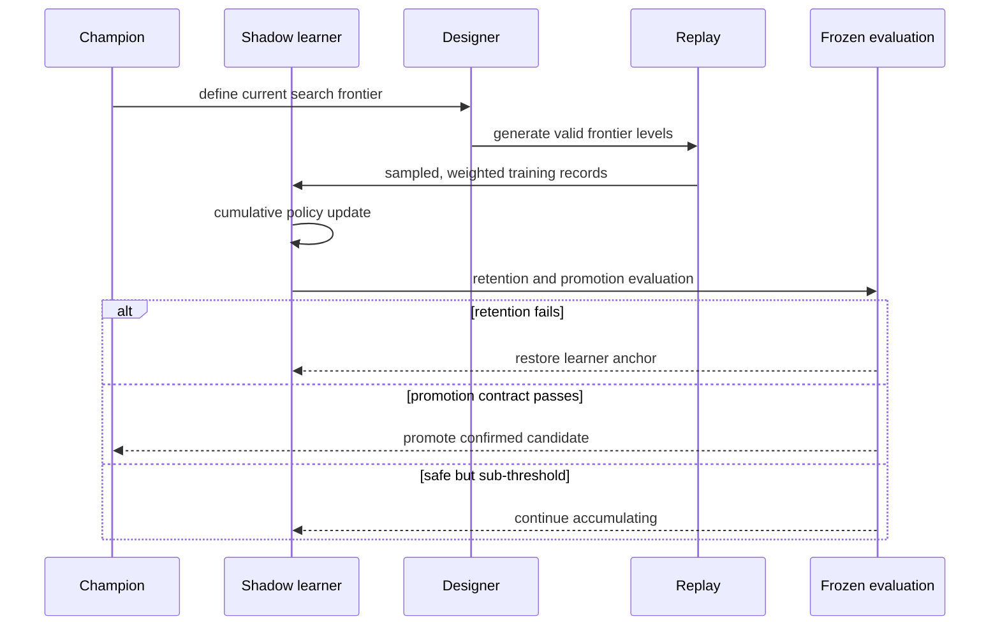

# Architecture

Block Out Sort is organized around a single rule: generated data, exact labels, learned predictions, and search evaluation must all agree with the playable game.

## System layers

### Playable browser game

The browser client is dependency-free JavaScript rendered with Canvas. `js/game.js` owns movement, collision, exits, frozen blocks, locked gates, and terminal-state behavior. `js/main.js` handles input, animation, and presentation.

### Mirrored Python environment

`python/blocksort/environment.py` implements the same transition system for experiments. Language-neutral fixtures exercise legal actions, state transitions, canonical identities, and terminal behavior in both implementations. This prevents a model from being trained on a subtly different game than the player sees.

### Exact reference layer

A* is the primary exact solver, with BFS available as a slower cross-check. The oracle derives optimal costs, action regret, and exact policy/value supervision. Dataset validation replays records through the environment instead of trusting stored labels.

### Neural-guided bounded search

The policy-value network predicts action priors and state values. PUCT uses those predictions to allocate a fixed simulation budget. Evaluation therefore measures a solve curve across several budgets rather than treating solver strength as one number.

### Level designer

The generator uses reverse construction so an accepted level retains a constructive solvability witness. The adversarial designer searches within those validity constraints for puzzles near the protagonist's learning frontier.

### Expert iteration and co-training

The training stack supports:

- weighted replay and explicit record provenance;
- exact and search-derived labels with separate value supervision;
- deterministic sampling identities and persisted samples;
- resumable, transaction-like run state;
- champion/learner separation so small updates can accumulate without prematurely replacing the official model;
- frozen promotion, retention, and candidate-blind confirmation pools;
- checkpoint ancestry and content hashes.

## Evaluation flow

This separation emerged from an observed failure mode: when every rejected candidate was discarded, individually useful but sub-threshold updates could not accumulate. The learner may continue after a safe update, while the champion changes only after the stricter promotion contract passes.

## Design principles

1. **Game semantics are testable contracts.** The browser is not an approximate visualization of the Python environment.
2. **Solvability and difficulty are separate questions.** Construction guarantees the former; exact or bounded search measures the latter.
3. **A checkpoint is not a result by itself.** Claims include the pool identity, sampling contract, budgets, weights, uncertainty estimate, and ancestry.
4. **Evaluation data changes status when inspected.** An opened diagnostic pool cannot later serve as candidate-blind confirmation evidence.
5. **Failures should narrow the hypothesis.** Retention, trace, target, and replay experiments are controlled changes rather than an unconstrained hyperparameter search.
